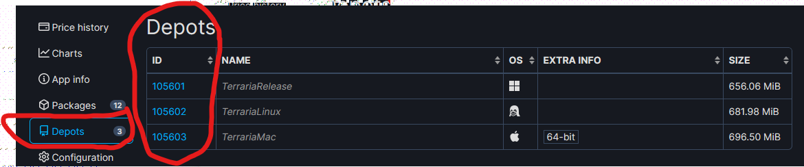
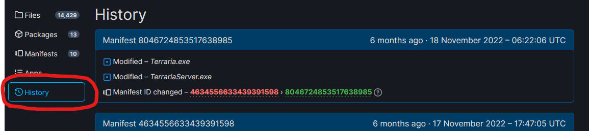
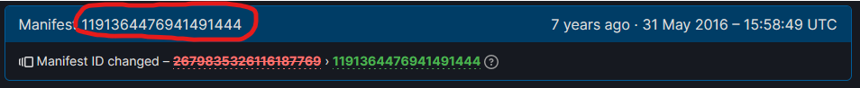
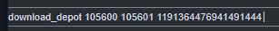

# How to downgrade Calamity to an older version.
In this guide, I'll be showing y'all how to downgrade Calamity to an older version. To be more specific, I'll be downgrading Calamity to version 1.0.3. I will also be showing how to downgrade tmodloader and Terraria if needed.
Note that I only know how to downgrade the Steam version of Terraria. For GOG users, you can still follow along, but you're going to have to figure out how to downgrade Terraria yourself, if needed. 

# Step 1: Getting the Calamity version.
First, you need to know what version you want to downgrade to. You can check the  [version history](https://Calamitymod.wiki.gg/wiki/Version_history) on the official wiki to see which one you want. Once you have a version in mind, head on over to the archives of the mod on [archive.org,](https://archive.org/download/Calamitymodold) since some GigaChad archive most of the Calamity versions. 

# Step 2: Loading the mod into Tmodloader
The first thing that you're going want to do is to downgrade Tmodloader to 1.3. If you don't know how to do that, then you can follow [this guide on how to downgrade to 1.3 on the tmodloader wiki.](https://github.com/tModLoader/tModLoader/wiki/tModLoader-guide-for-players#to-access-13-legacy-tmodloader-and-other-beta-options)  

Once you do that, you should manually install the mod. If you don't know how to do that, I'll show you. The first thing that you want to do is to click on the mod button from the main menu of Tmodloader. Once you do that, you should see a button at the bottom center labeled, "Open Mods Folder".

Clicking on that button should open up a folder in your OS's file explorer. If it doesn't, then you can manually navigate to the folder path. 

**Windows**: `%UserProfile%\Documents\My Games\Terraria\ModLoader\Mods`
**Mac**: `/Users/account/Library/Application Support/Terraria/ModLoader/Mods`  
**Linux**: `~/.local/share/Terraria/ModLoader/Mods` **OR** `$XDG_DATA_HOME/Terraria/ModLoader/Mods`

Once you're at the folder, the first thing that you're going want to do is it get rid of the Calamity mod that is currently inside the folder, if you still have it installed. Just drag and drop it out of the folder, or delete it. Once the newer version is gone, just drag and drop the older mod that you downloaded into the folder. Then go back to Tmodloader, and go back to the main menu. Once on the main menu, you should head back into the mods. The mod list should refresh and show you the older version. There may be a warning message telling you that the mod is old. Ignore it for now. Enable the mod and reload the mod. 

If it was able to load the mod, then you have officially downgraded Calamity. If Tmodloader is telling you that the mod is made for an older version of Tmodloader, or if you want to use an older version of Tmodloader for better capability, then follow to the third step.

# Step 3: Downgrading Tmodloader. 
The first thing that you want to do is write down the version of Tmodloader that the mod is asking for. Once you write it down, head on over to the [offical Tmodloader forum page](https://forums.terraria.org/index.php?threads/1-3-tmodloader-a-modding-api.23726/) and scroll down till you see the "Download" section of the page. You should see a spoiler button at the bottom of the page that says "Past Version Downloads". 

Click on the button. It should load in a list of all the past versions. Just look for the version that Calamity is asking for, and download it for your OS. For me, Calamity 1.0.3 is asking for version 0.8.1.1. Do note the Terraria version that it mentioned. We will need it in the next step.

If you are downgrading for better capability, and don't know which version is for you, then here is what you do. First, get  the release date of the Calamity mod. The date can be obtained from the [version history.](https://Calamitymod.wiki.gg/wiki/Version_history) Then, you need to scroll through all the releases of Tmodloader on [the release section on the Tmodloader's GitHub repo.](https://github.com/tModLoader/tModLoader/releases) Scroll through until you find the version that is the closest to your version, but is release before the mod's release date. Once you find the version number, then head on back to the forum page, and download the version based on your OS.

You're not done yet. Terraria also has to be downgraded in order for Tmodloader to support it. 

# Step 4: Downgrading Terraria.
This is the final step that you have to do before playing the mod. You should have noticed that when downloading the older version of Tmodloader, it has also mentioned the Terraria version associated with it and write it down. In my case, I need to downgrade Terraria to version 1.3.1.1.

Once you got the version, open up your favorite browser, and type in steam://open/console into the URL bar and press enter. 
It should open up the hidden Steam console. If it doesn't, for some reason, you're going to have to search up on how to open it up for you. In the Steam console, you're going to need to type out this command:
`download_depot <AppID> <Depot ID> <Manifest ID>`
As you notice, the command isn't complete. We will need to fill out the info needed. 

Keep the Steam console opened in the background, and head on over to the [Terraria page on SteamDB.](https://steamdb.info/app/105600/) In the table, you should see the App ID. The app ID is 105600. 

Next, we'll get the depot ID. On the left side of the page, you should see a depots section. Clicking on it will show you the depots for Windows, Mac, and Linux ports of Terraria. Grab the number for your OS. Since I'm on a Windows OS, my depot will be 105601. 

Once you have your depots ID, click on the depot ID. Now, on the left-hand side, you should see a history section. Click on it. It should show you all of the updates and manifest for the game. 

However, it won't show you the version numbers on this page. In order to know that, you will need to know the release date of the Terraria updates. To get that, just look for the version number on the [Desktop Version History.](https://terraria.wiki.gg/wiki/Desktop_version_history) Once you got your release date. Head back to the manifest page, and scroll all the way till you find the manifest ID that matches the release date. For me, my manifest ID was 1191364476941491444.

Once you have all three IDS, type in the command with the appropriate IDS filled in into the Steam console and press enter. This is what my command looked like.

You should see that Steam is downloading it. Note that Steam will NOT REPLACE YOUR CURRENT INSTALLATION of Terraria or Tmodloader. THIS WILL TAKE A WHILE. There is no progress bar, you will have to wait for a while. For me, it took me an hour for it to download. Once it is done, it will tell you in the console where it installed the older version at. All you have to do is to drag and drop the contents inside the zip folder of the older tmodloader, replace the Terraria.exe, and launch Terraria.exe. Give it a second to launch up. You should see in the bottom left of Terraria that you are in an older version of Terraria.

Walla. You have successfully downgraded Calamity, Tmodloader, And Terraria. If you had any issues, either report them in the issues side, or Report them to my [Discord Server.](https://discord.com/invite/uq5hpBWr8D)